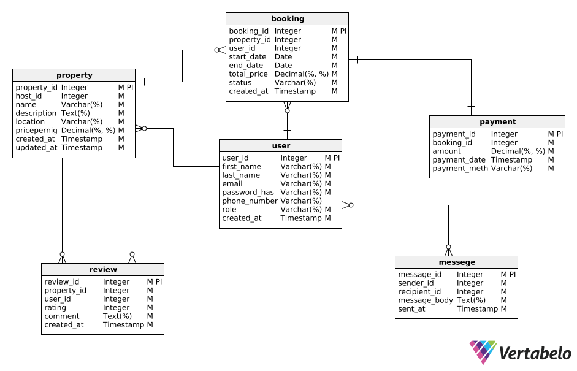

# 🏡 Airbnb Database Design

## 📌 Objective

Design and implement a relational database schema for an Airbnb-like platform. The schema supports user management, property listings, bookings, payments, reviews, and messaging between users.

This document describes the database requirements and entity-relationship (ER) design.

---

## 📦 Entities and Attributes

### 👤 User

| Field          | Type     | Constraints                                |
|----------------|----------|--------------------------------------------|
| `user_id`      | UUID     | Primary Key, Indexed                       |
| `first_name`   | VARCHAR  | NOT NULL                                   |
| `last_name`    | VARCHAR  | NOT NULL                                   |
| `email`        | VARCHAR  | UNIQUE, NOT NULL                           |
| `password_hash`| VARCHAR  | NOT NULL                                   |
| `phone_number` | VARCHAR  | NULLABLE                                   |
| `role`         | ENUM     | Values: `guest`, `host`, `admin`; NOT NULL |
| `created_at`   | TIMESTAMP| DEFAULT CURRENT_TIMESTAMP                  |

---

### 🏠 Property

| Field           | Type     | Constraints                                |
|------------------|----------|--------------------------------------------|
| `property_id`     | UUID     | Primary Key, Indexed                       |
| `host_id`         | UUID     | Foreign Key → `User(user_id)`             |
| `name`            | VARCHAR  | NOT NULL                                   |
| `description`     | TEXT     | NOT NULL                                   |
| `location`        | VARCHAR  | NOT NULL                                   |
| `pricepernight`   | DECIMAL  | NOT NULL                                   |
| `created_at`      | TIMESTAMP| DEFAULT CURRENT_TIMESTAMP                  |
| `updated_at`      | TIMESTAMP| ON UPDATE CURRENT_TIMESTAMP                |

---

### 📅 Booking

| Field         | Type     | Constraints                                  |
|----------------|----------|----------------------------------------------|
| `booking_id`   | UUID     | Primary Key, Indexed                         |
| `property_id`  | UUID     | Foreign Key → `Property(property_id)`        |
| `user_id`      | UUID     | Foreign Key → `User(user_id)`                |
| `start_date`   | DATE     | NOT NULL                                     |
| `end_date`     | DATE     | NOT NULL                                     |
| `total_price`  | DECIMAL  | NOT NULL                                     |
| `status`       | ENUM     | Values: `pending`, `confirmed`, `canceled`  |
| `created_at`   | TIMESTAMP| DEFAULT CURRENT_TIMESTAMP                    |

---

### 💰 Payment

| Field           | Type     | Constraints                                 |
|------------------|----------|---------------------------------------------|
| `payment_id`     | UUID     | Primary Key, Indexed                        |
| `booking_id`     | UUID     | Foreign Key → `Booking(booking_id)`        |
| `amount`         | DECIMAL  | NOT NULL                                    |
| `payment_date`   | TIMESTAMP| DEFAULT CURRENT_TIMESTAMP                   |
| `payment_method` | ENUM     | Values: `credit_card`, `paypal`, `stripe`  |

---

### ⭐ Review

| Field         | Type     | Constraints                                  |
|----------------|----------|----------------------------------------------|
| `review_id`    | UUID     | Primary Key, Indexed                         |
| `property_id`  | UUID     | Foreign Key → `Property(property_id)`        |
| `user_id`      | UUID     | Foreign Key → `User(user_id)`                |
| `rating`       | INTEGER  | NOT NULL, CHECK: 1 ≤ rating ≤ 5              |
| `comment`      | TEXT     | NOT NULL                                     |
| `created_at`   | TIMESTAMP| DEFAULT CURRENT_TIMESTAMP                    |

---

### 💬 Message

| Field         | Type     | Constraints                                  |
|----------------|----------|----------------------------------------------|
| `message_id`   | UUID     | Primary Key, Indexed                         |
| `sender_id`    | UUID     | Foreign Key → `User(user_id)`                |
| `recipient_id` | UUID     | Foreign Key → `User(user_id)`                |
| `message_body` | TEXT     | NOT NULL                                     |
| `sent_at`      | TIMESTAMP| DEFAULT CURRENT_TIMESTAMP                    |

---

## 🔗 Relationships

- **User → Property**: A user (host) can list many properties.
- **User → Booking**: A user (guest) can make many bookings.
- **Property → Booking**: A property can be booked many times.
- **Booking → Payment**: Each booking has one associated payment.
- **User → Review**: A user can write multiple reviews.
- **Property → Review**: A property can receive multiple reviews.
- **User → Message**: Users can send and receive multiple messages.

---

## ⚙️ Constraints

- **User**:
  - `email` must be unique.
  - Required: `first_name`, `last_name`, `email`, `password_hash`, `role`.

- **Property**:
  - `host_id` must reference a valid user.
  - `name`, `description`, `location`, `pricepernight` are required.

- **Booking**:
  - Must reference valid `property_id` and `user_id`.
  - `status` must be one of: `pending`, `confirmed`, `canceled`.

- **Payment**:
  - Must reference valid `booking_id`.
  - `payment_method` must be one of: `credit_card`, `paypal`, `stripe`.

- **Review**:
  - Rating must be between 1 and 5.
  - Must reference valid `user_id` and `property_id`.

- **Message**:
  - Must reference valid `sender_id` and `recipient_id`.

---

## 🧠 Indexing

- All primary keys are indexed automatically.
- Additional indexes:
  - `email` in the `User` table.
  - `property_id` in `Property`, `Booking`, and `Review` tables.
  - `booking_id` in `Booking` and `Payment` tables.

---

## 🗂 ER Diagram

> The Entity-Relationship (ER) diagram was created using **Vertabelo**.

---

## ✅ Summary

This schema provides a robust relational structure that supports key Airbnb functionalities, enforces data integrity through foreign keys and constraints, and ensures efficient query performance via indexing.

---

